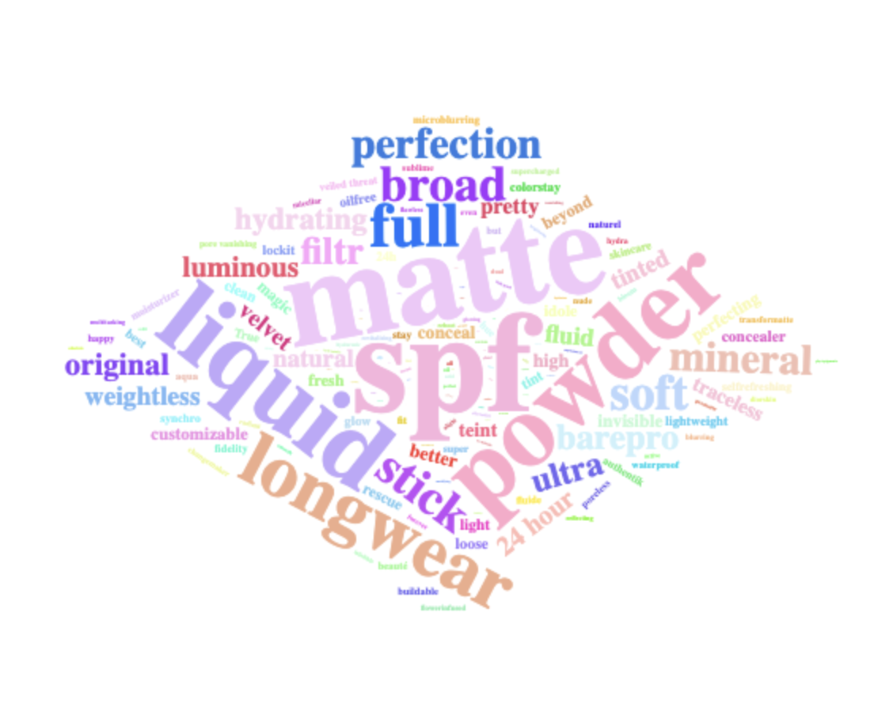

# The "Perfect" Foundation
Hi ✋! Take a look at my article [here](https://kristen-shen.github.io/perfect-foundation/).

## 📝 A Snapshot of the Project
In this data-driven project, I explored all makeup foundation shades on [Sephora](https://www.sephora.com/shop/foundation-makeup?pageSize=300")
and [Ulta](https://www.ulta.com/?cmpid=PS_Brand!google!Brand&utm_source=google&utm_medium=paidsearch&CAWELAID=1831598544&CATRK=SPFID-1&CAAGID=540267060&CATCI=kwd-12627301&CAPCID=476595550201&CADevice=c&gad_source=1&gclid=Cj0KCQiA8fW9BhC8ARIsACwHqYod1XSjB7B7oKtkhR8EVjgCWh3n5CQ9gDRON_RrIaVbun2XCeXteo4aAvuDEALw_wcB) U.S. webiste and analyzed the word frequencies of each product's name. 

I also contextualize the data with current fashion trends to examine its social and cultural embeddings.

## 📊 Methods
### Word Frequency Analysis
#### Quantitative + Qualitative
- Self-learned [online tutorial](https://investigate.ai/text-analysis/counting-words-with-pythons-counter/) ane explored different methods
- Self-learned [plotly](https://plotly.com/python/pca-visualization/) for 3D PCA analysis
- Used Counter [https://pymotw.com/3/collections/counter.html] tool 
- semantic analysis consulting [Oxford English Dictionary](https://www.oed.com/?tl=true) and [the academic paper](https://www.doria.fi/bitstream/handle/10024/180034/selen_jennie.pdf?sequence=2)
### Visualization 
- :`ggplot` + `wordcloud 2` package
- : `pandas` + `python` for data cleaning; `ggplot`
- multiple word frequency tables: `pandas` + `python` for data cleaning; `datawrapper`